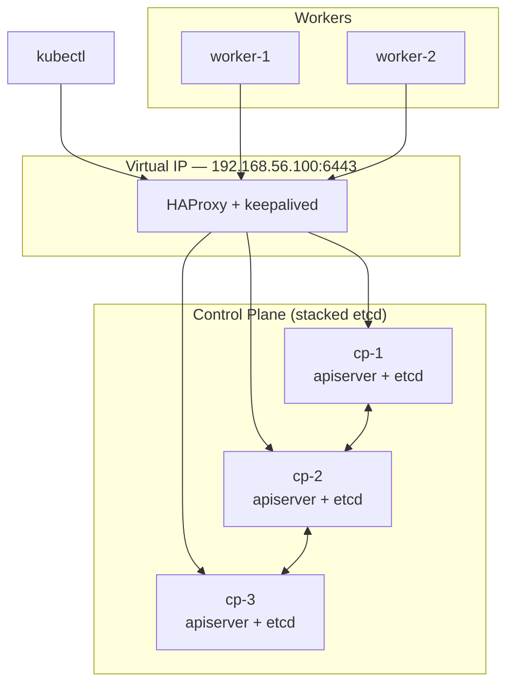

# irshadproject — Multi-Node Kubernetes HA Cluster (kubeadm)

A highly-available Kubernetes cluster built with `kubeadm` on Ubuntu VMs:
**3 control-plane nodes + 2 worker nodes**, stacked etcd, behind a virtual-IP load balancer.

Built against **Kubernetes v1.37** (current stable: `v1.37.1`).

---

## Architecture



**Why 3 control planes?** etcd needs a quorum of `(n/2)+1` to accept writes. With 3 members,
quorum is 2 — so the cluster survives **one** node failure. Two control planes would be
*worse* than one: quorum would be 2 of 2, so any single failure freezes the cluster.
Always use an odd number.

**Stacked etcd** means etcd runs as a static pod on each control-plane node rather than on
dedicated hosts. Simpler to operate; the tradeoff is that losing a node loses both an
apiserver and an etcd member together.

### Node inventory

Fill in your own addresses:

| Role | Hostname | IP | CPU | RAM |
|---|---|---|---|---|
| Load balancer VIP | — | `192.168.56.100` | — | — |
| Control plane | `cp-1` | `192.168.56.101` | 2 | 2 GB |
| Control plane | `cp-2` | `192.168.56.102` | 2 | 2 GB |
| Control plane | `cp-3` | `192.168.56.103` | 2 | 2 GB |
| Worker | `worker-1` | `192.168.56.111` | 2 | 2 GB |
| Worker | `worker-2` | `192.168.56.112` | 2 | 2 GB |

> 2 CPU / 2 GB is the **kubeadm minimum** for a control-plane node, not a comfortable
> amount. Use 2 CPU / 4 GB if your host can spare it. Total for this topology at 4 GB
> each is 20 GB — check your RAM before starting.

---

## Prerequisites

- 5 Ubuntu 24.04 LTS VMs (VirtualBox, Multipass, Proxmox, or any cloud)
- All nodes on the same L2 network, with **unique** hostname, MAC address, and
  `/sys/class/dmi/id/product_uuid`
- Full network connectivity between all nodes
- Passwordless `sudo`
- Required ports open: `6443` (apiserver), `2379-2380` (etcd), `10250` (kubelet),
  `10257`/`10259` (controller-manager/scheduler), `30000-32767` (NodePort)

⚠️ **Pod CIDR must not overlap your VM network.** This README uses `10.244.0.0/16` for pods
precisely because Calico's default (`192.168.0.0/16`) collides with the common VirtualBox
host-only range `192.168.56.0/24`. An overlap produces a cluster that comes up "Ready"
and then routes traffic into a black hole — one of the hardest failures to debug here.

---

## Step 0 — Load balancer (on a separate host or both LB nodes)

Every control plane must be reachable through **one stable endpoint**. Without this,
`kubeadm` bakes a single node's IP into the cluster config and you have no HA.

Install HAProxy + keepalived:

```bash
sudo apt update && sudo apt install -y haproxy keepalived
```

`/etc/haproxy/haproxy.cfg`:

```
frontend kubernetes-api
    bind *:6443
    mode tcp
    option tcplog
    default_backend kubernetes-controlplane

backend kubernetes-controlplane
    mode tcp
    option tcp-check
    balance roundrobin
    server cp-1 192.168.56.101:6443 check fall 3 rise 2
    server cp-2 192.168.56.102:6443 check fall 3 rise 2
    server cp-3 192.168.56.103:6443 check fall 3 rise 2
```

`/etc/keepalived/keepalived.conf` (on the primary; use `BACKUP` and lower priority on the peer):

```
vrrp_instance VI_1 {
    state MASTER
    interface enp0s8
    virtual_router_id 51
    priority 101
    authentication {
        auth_type PASS
        auth_pass changeme
    }
    virtual_ipaddress {
        192.168.56.100
    }
}
```

```bash
sudo systemctl enable --now haproxy keepalived
```

Verify the VIP answers before continuing:

```bash
nc -zv 192.168.56.100 6443
```

---

## Step 1 — Prepare every node (all 5)

Run this on **all** nodes, control plane and workers alike.

### Disable swap

```bash
sudo swapoff -a
sudo sed -i '/ swap / s/^/#/' /etc/fstab
```

The kubelet refuses to start with swap enabled unless explicitly configured otherwise.
Editing `/etc/fstab` is what makes it survive a reboot — skipping that line is why
clusters "work until I restart the VM."

### Kernel modules and sysctl

```bash
cat <<EOF | sudo tee /etc/modules-load.d/k8s.conf
overlay
br_netfilter
EOF

sudo modprobe overlay
sudo modprobe br_netfilter

cat <<EOF | sudo tee /etc/sysctl.d/k8s.conf
net.bridge.bridge-nf-call-iptables  = 1
net.bridge.bridge-nf-call-ip6tables = 1
net.ipv4.ip_forward                 = 1
EOF

sudo sysctl --system
```

### Container runtime (containerd)

```bash
sudo apt update && sudo apt install -y containerd
sudo mkdir -p /etc/containerd
containerd config default | sudo tee /etc/containerd/config.toml >/dev/null
sudo sed -i 's/SystemdCgroup = false/SystemdCgroup = true/' /etc/containerd/config.toml
sudo systemctl restart containerd && sudo systemctl enable containerd
```

⚠️ **`SystemdCgroup = true` is mandatory.** Ubuntu 24.04 uses the systemd cgroup driver,
and a mismatch between containerd and the kubelet causes pods to start and then die under
memory pressure — with no clear error pointing at the cause.

### Install kubeadm, kubelet, kubectl

```bash
sudo apt install -y apt-transport-https ca-certificates curl gpg

curl -fsSL https://pkgs.k8s.io/core:/stable:/v1.37/deb/Release.key \
  | sudo gpg --dearmor -o /etc/apt/keyrings/kubernetes-apt-keyring.gpg

echo 'deb [signed-by=/etc/apt/keyrings/kubernetes-apt-keyring.gpg] https://pkgs.k8s.io/core:/stable:/v1.37/deb/ /' \
  | sudo tee /etc/apt/sources.list.d/kubernetes.list

sudo apt update && sudo apt install -y kubelet kubeadm kubectl
sudo apt-mark hold kubelet kubeadm kubectl
```

`apt-mark hold` prevents an unattended `apt upgrade` from skipping a minor version and
breaking the cluster. Kubernetes only supports upgrading **one minor version at a time**.

> The repo path is version-pinned. To move to v1.38 later you must edit
> `/etc/apt/sources.list.d/kubernetes.list` — there is no "latest" channel.

---

## Step 2 — Initialise the first control plane (`cp-1` only)

```bash
sudo kubeadm init \
  --control-plane-endpoint "192.168.56.100:6443" \
  --upload-certs \
  --pod-network-cidr=10.244.0.0/16 \
  --kubernetes-version v1.37.1
```

- `--control-plane-endpoint` → the VIP. **Required for HA**, and it cannot be added later
  without rebuilding the cluster.
- `--upload-certs` → stores the CA certs in a cluster secret so the other control planes
  can join without manual cert copying.

Save both join commands from the output. Then set up `kubectl`:

```bash
mkdir -p $HOME/.kube
sudo cp /etc/kubernetes/admin.conf $HOME/.kube/config
sudo chown $(id -u):$(id -g) $HOME/.kube/config
```

---

## Step 3 — Install a CNI (`cp-1`)

Nodes stay `NotReady` and CoreDNS stays `Pending` until a network plugin is installed.
This is expected, not a failure.

```bash
kubectl create -f https://raw.githubusercontent.com/projectcalico/calico/master/manifests/tigera-operator.yaml
```

Then apply a `Installation` resource whose `cidr` matches the `--pod-network-cidr` above
(`10.244.0.0/16`). Check <https://docs.tigera.io/calico/latest/getting-started/kubernetes/quickstart>
for the current custom-resources manifest and pin a released version tag rather than
`master` for anything you intend to keep.

Wait for readiness:

```bash
kubectl wait --for=condition=Ready node --all --timeout=180s
```

---

## Step 4 — Join the other control planes (`cp-2`, `cp-3`)

Use the `--control-plane` join command from Step 2:

```bash
sudo kubeadm join 192.168.56.100:6443 \
  --token <token> \
  --discovery-token-ca-cert-hash sha256:<hash> \
  --control-plane \
  --certificate-key <certificate-key>
```

⏱ **The certificate key expires 2 hours after `kubeadm init`.** If you've taken longer,
regenerate it on `cp-1`:

```bash
sudo kubeadm init phase upload-certs --upload-certs
```

Then set up `kubectl` on each (same three commands as Step 2).

---

## Step 5 — Join the workers

Use the plain join command (no `--control-plane`, no `--certificate-key`):

```bash
sudo kubeadm join 192.168.56.100:6443 \
  --token <token> \
  --discovery-token-ca-cert-hash sha256:<hash>
```

⏱ **Tokens expire after 24 hours.** Regenerate on any control plane:

```bash
sudo kubeadm token create --print-join-command
```

---

## Verification

```bash
kubectl get nodes -o wide
```

Expect 5 nodes `Ready`, with `control-plane` in the ROLES column for three of them.

```bash
# All 3 etcd members present and healthy
kubectl -n kube-system exec -it etcd-cp-1 -- etcdctl \
  --endpoints=https://127.0.0.1:2379 \
  --cacert=/etc/kubernetes/pki/etcd/ca.crt \
  --cert=/etc/kubernetes/pki/etcd/server.crt \
  --key=/etc/kubernetes/pki/etcd/server.key \
  member list -w table

# Control-plane pods, 3 of each
kubectl -n kube-system get pods -o wide | grep -E 'apiserver|controller-manager|scheduler|etcd'
```

### Prove HA actually works

A cluster is not HA until you've watched it survive a failure:

```bash
# Deploy something
kubectl create deployment nginx --image=nginx --replicas=3
kubectl expose deployment nginx --port=80 --type=NodePort

# Hard-stop one control plane
# (shut down cp-1 from your hypervisor)

# From another node — the API must still answer through the VIP
kubectl get nodes
kubectl scale deployment nginx --replicas=5
```

If `kubectl` hangs after killing one control plane, your load balancer is not failing over
— fix keepalived before trusting the cluster. Then bring `cp-1` back and confirm it
rejoins on its own.

---

## Troubleshooting

| Symptom | Likely cause |
|---|---|
| Nodes stuck `NotReady` | No CNI installed yet — expected before Step 3 |
| CoreDNS stuck `Pending` | Same; resolves once the CNI is up |
| Pods run then die unexpectedly | cgroup driver mismatch — check `SystemdCgroup = true` |
| Cluster breaks after VM reboot | swap re-enabled — `/etc/fstab` not edited |
| Pods can't reach each other | Pod CIDR overlaps the VM subnet |
| `kubeadm join` → "invalid token" | Token expired (24 h) — regenerate |
| CP join → cert-key error | Cert key expired (2 h) — re-run `upload-certs` |
| API unreachable after node loss | keepalived/HAProxy not failing over |

Useful commands:

```bash
sudo journalctl -xeu kubelet -f          # kubelet is where most failures surface
sudo crictl ps -a                        # containers, bypassing the kubelet
sudo kubeadm certs check-expiration      # cert expiry (kubeadm certs renew all)
```

---

## Teardown

```bash
# Per node
sudo kubeadm reset -f
sudo rm -rf /etc/cni/net.d $HOME/.kube
sudo iptables -F && sudo iptables -t nat -F && sudo iptables -t mangle -F && sudo iptables -X
```

`kubeadm reset` does **not** clear iptables rules or the CNI config. Leftovers from a
previous attempt are a common cause of a rebuilt cluster behaving strangely.

---

## References

- [kubeadm HA topology](https://kubernetes.io/docs/setup/production-environment/tools/kubeadm/high-availability/)
- [Creating a cluster with kubeadm](https://kubernetes.io/docs/setup/production-environment/tools/kubeadm/create-cluster-kubeadm/)
- [Container runtimes](https://kubernetes.io/docs/setup/production-environment/container-runtimes/)
- [etcd FAQ — quorum](https://etcd.io/docs/latest/faq/)
