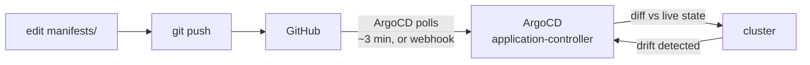

# GitOps with ArgoCD

Git is the source of truth for this cluster. Nothing here is applied by hand — ArgoCD
pulls from `main` and makes the cluster match.

## The loop



The reverse arrow is the part that matters. ArgoCD doesn't just deploy — it continuously
compares live state against Git and corrects any difference.

## What's wired up

| Piece | Where | Role |
|---|---|---|
| `Application` CR | [`argocd/application.yaml`](../argocd/application.yaml) | the Git↔cluster link. Applied once by hand. |
| Managed manifests | [`manifests/`](../manifests/) | everything ArgoCD owns |
| Repo | `github.com/irshadstars/irshadproject` | public, so no credentials needed |

Sync policy:

```yaml
syncPolicy:
  automated:
    prune: true      # deleting a manifest from Git deletes it from the cluster
    selfHeal: true   # manual kubectl changes are reverted
```

**`prune: true` matters more than it looks.** Without it, removing a manifest from Git
leaves the resource running forever. Git stops describing reality and starts merely
describing intent — the whole guarantee collapses quietly.

**`selfHeal: true`** is what makes drift impossible rather than discouraged. Measured
here: a manual `kubectl scale` was reverted in **~3 seconds**.

> `argocd/application.yaml` sits deliberately *outside* `manifests/` so ArgoCD does not
> manage its own definition. Likewise, editing `docs/` or `README.md` triggers no sync —
> the Application watches `path: manifests` only.

## Verifying it

```bash
kubectl -n argocd get app demo                 # expect Synced / Healthy
kubectl -n demo get pods -o wide
curl http://localhost:30080                    # NodePort, mapped by kind/dev-cluster.yaml
```

### Prove convergence

```bash
# Change replicas in manifests/deployment.yaml, then:
git commit -am "scale to 6" && git push
kubectl -n demo get pods -w                    # converges with no kubectl apply
```

### Prove self-healing

```bash
kubectl -n demo scale deploy/whoami --replicas=1
kubectl -n demo get deploy whoami              # run FAST — reverted in ~3s
```

You will probably miss it. That's the point.

## Two things learned the hard way

### 1. ArgoCD needs server-side apply to install

```bash
kubectl apply -n argocd -f .../install.yaml                    # ✗ fails
kubectl apply -n argocd --server-side=true -f .../install.yaml # ✓ works
```

Client-side apply stores the whole manifest in a
`kubectl.kubernetes.io/last-applied-configuration` annotation, and the
`applicationsets.argoproj.io` CRD exceeds the 262 144-byte annotation limit:

```
The CustomResourceDefinition "applicationsets.argoproj.io" is invalid:
metadata.annotations: Too long: may not be more than 262144 bytes
```

If a partial client-side apply already ran, add `--force-conflicts` to take over the
field managers it left behind.

### 2. topologySpreadConstraints are scheduling-time only

After a rolling update, pods sat **3 / 1** across two workers — violating
`maxSkew: 1` — and Kubernetes never corrected it.

Why: old-ReplicaSet pods still occupied `worker2` while the new ones were being placed,
so new pods landed on `worker`. When the old pods terminated, the imbalance simply
remained. **The scheduler makes a point-in-time decision and never revisits it.**
Deleting one pod forced a fresh decision and the spread became 2 / 2.

If even distribution matters in production, the constraint alone will not maintain it —
you need the [descheduler](https://github.com/kubernetes-sigs/descheduler).

A related trap, which is why the constraint carries `nodeTaintsPolicy: Honor`: by default
**every** node matching the `topologyKey` counts as a domain, including tainted ones the
pod can never land on. The control-plane node counted as a domain holding 0 pods, so
`min = 0`, so a worker holding 2 pods was already skew 2 — and replicas 3 and 4 stayed
`Pending` forever with a constraint that could never be satisfied.

## Next steps worth trying

- **Webhook instead of polling** — ArgoCD polls every ~3 min by default; a GitHub webhook
  makes sync near-instant.
- **App-of-apps** — one Application managing other Applications, which is how this scales
  past a single app.
- **Kustomize overlays** — `manifests/base` + `overlays/dev|prod` instead of flat YAML.
- **Image updater** — auto-bump image tags in Git when a new build is pushed.
- **Sync waves** — `argocd.argoproj.io/sync-wave` annotations to order dependent resources.
